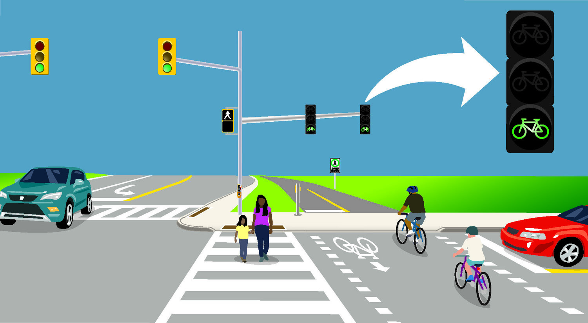

# How Safe Are NYC Streets for Cyclists and Pedestrians?

This is a breakdown of every collision in NYC by location and injury. The data is collected as a result of the NYC Council passing Local Law #11 in 2011. Each record represents a collision in NYC by city, borough, precinct and cross street. This data can be used by the public to see how dangerous/safe intersections are in NYC. The information is presented in csv format to allow the user to do in-depth analyses.

